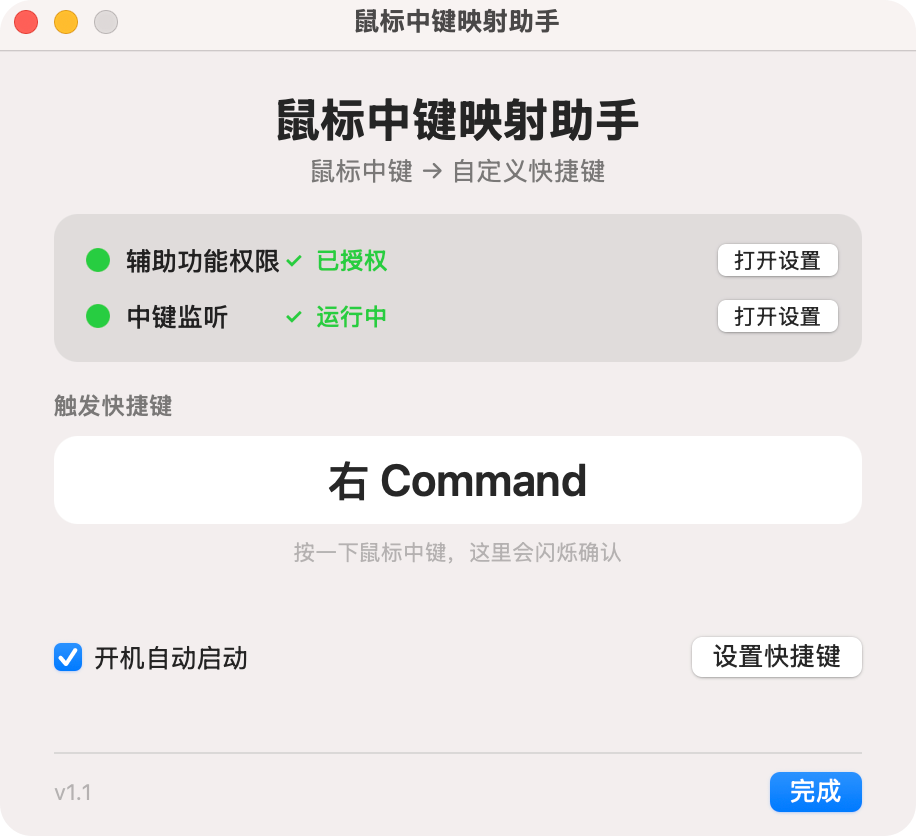

# Middle Click Mapper

**[中文](README.md) | English**

A lightweight macOS background utility that maps the **middle mouse button** to **any custom keyboard shortcut**.

Hold the middle button to trigger the shortcut, release to end — perfect for turning the middle button into push-to-talk voice input, global search, screenshots, or any feature that benefits from a "hold to trigger" gesture.

## How It Works

The app listens to global mouse events via `CGEventTap`, detects middle button (button 2) press/release, and simulates the configured keyboard shortcut using `CGEvent`.

```
middle button down ──▶ simulates "shortcut" key down
middle button up   ──▶ simulates "shortcut" key up
```

The default mapping is **Right ⌘**, which works out of the box with voice-input apps (many of them use Right ⌘ as their push-to-talk shortcut). You can also rebind it to any key combination in the UI.

## Default Configuration

| Item | Default |
|------|---------|
| Mouse button listened | Middle button (button 2) |
| Mapped shortcut | Right ⌘ (Right Command) |
| Trigger mode | Hold to trigger, release to end |

## UI Preview

<p align="center">
  
</p>

**Status visualization** is the core design — whether permission is granted, whether the listener is running, and whether the middle button was captured, all at a glance. When you press the middle button, the shortcut box flashes ✓ for instant confirmation.

## Install (for users)

This app is **ad-hoc signed** (no paid developer certificate), so the first launch requires bypassing macOS Gatekeeper once. After that it works normally.

1. Open `鼠标中键映射助手.dmg` and drag `鼠标中键映射助手.app` to `Applications`.
2. **First launch**: **Right-click → Open** on the app icon (or two-finger tap on trackpad).
   > ⚠️ Don't double-click directly. Double-clicking shows "can't be opened / is damaged" — this is normal Gatekeeper behavior for unsigned apps, not actual corruption. After right-click → Open, a dialog with an "Open" button appears; click it. **The system remembers this, and future double-clicks work directly.**
3. Open the app, click the **"前往授权"** (Authorize) button (or go to `System Settings → Privacy & Security → Accessibility`).
4. Enable the toggle for `鼠标中键映射助手`.
5. Back in the app window, confirm the status card shows green dots (authorized · listening), then press the middle mouse button to test.

## Usage

- **Open the UI**: click the **⌘ icon** in the menu bar, or click the Dock icon.
- **Rebind the shortcut**: click "设置快捷键" (Set Shortcut), then press your desired key combo (a single modifier like Right ⌘ also works).
- **Launch at login**: check "开机自动启动" in the window. It shows up in Login Items as "鼠标中键映射助手".
- **Pair with a voice-input app**: set that app's push-to-talk shortcut to Right ⌘, and the middle button becomes "hold to speak".

## Build (for developers)

```sh
./build.sh
```

The build script will:

1. Compile `src/MiddleClickMapper.swift` with `swiftc`, producing `dist/鼠标中键映射助手.app`.
2. Sign with **ad-hoc** (`codesign -s -`) + Hardened Runtime.
3. Clean up stale TCC permission records on this machine (see notes below).
4. Package into `dist/鼠标中键映射助手.dmg` (contains the app, an Applications symlink, and a background image).

### Requirements

- macOS 13.0+
- Swift command line tools (Xcode Command Line Tools is enough; full Xcode not required)

### Project Structure

```
├── src/
│   └── MiddleClickMapper.swift   # all source (single file, AppKit)
├── assets/
│   ├── AppIcon.icns              # app icon
│   ├── AppIcon.iconset/          # icon sources
│   └── dmg-background.png        # DMG background
├── build.sh                      # build script (compile + sign + DMG)
└── dist/                         # build output
    ├── 鼠标中键映射助手.app
    └── 鼠标中键映射助手.dmg
```

## Notes on Signing

**Why ad-hoc signing?**
This app is for free distribution and has no paid Apple Developer account. The trade-off is that recipients must "right-click → Open" once on first launch. To allow direct double-clicking (zero manual steps), you'd need an Apple Developer account for Developer ID signing + notarization.

**Why re-authorize after every rebuild?**
The cdhash of an ad-hoc-signed binary changes with every build, and macOS TCC (Accessibility permission) is keyed off the binary fingerprint — once it changes, the old permission is invalid. `build.sh` auto-cleans stale records (`tccutil reset`); just restart the app and re-authorize once after building.

> Note: this friction only affects **local repeated builds** during development. The DMG you distribute is a single fixed version; recipients' machines are clean and only need to authorize once.

## Technical Highlights

- **`CGEventTap`** (`.cgSessionEventTap`) globally listens for the middle button, filtering `otherMouseDown/Up` (button 2).
- **`CGEvent`** simulates keypresses, precisely handling modifier-key order and flags to avoid combo-key glitches.
- **`LSUIElement = true`** runs the app as a background agent (no Dock by default), while dynamically switching activation policy to support both "Dock-openable" + "menu-bar-resident" entry points.
- **LaunchAgent** launches the app binary directly (not via `/usr/bin/open`), so Login Items shows the real app name.

## License

This project is open-sourced under the [MIT License](LICENSE).

In short: you're free to use, modify, and distribute it (including commercially), as long as you keep the copyright notice and license text. See [LICENSE](LICENSE) for details.

> Each machine still needs to grant Accessibility permission once on first run (a macOS security requirement that can't be bypassed).
